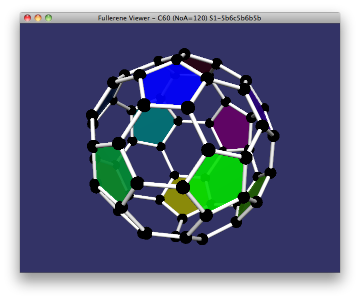

# FullereneViewer
## フラーレンビューア

### 1) はじめに (Introduction)
　フラーレンビューアは、フラーレン分子模型を3D表示してぐるぐる回して見るツールです。フラーレンの応用などは [ネットで検索](http://websearch.rakuten.co.jp/Web?toolid=1&ref=ie_box&set=tb&qt=%E3%83%95%E3%83%A9%E3%83%BC%E3%83%AC%E3%83%B3&col=OW) してみてください。  
　C60 から C200 まで数学的に構成可能な全てのフラーレンを見ることができます。従って、化学的には実在しないものも含まれます。  
　YouTube に [フラーレンビューア紹介ビデオ](https://www.youtube.com/watch?v=J_qkGaMuqyE) をアップしました。  
　また、以下を表示するおまけ付きです。
* カーボンナノチューブ
* 七員環を６個使ったY-分岐フラーレン

### 2) スクリーンショット (Screenshots)

### 3) コンパイル方法 (How To Compile)
　[doc/HowToCompile-ja.md](doc/HowToCompile-ja.md) を見てコンパイルしてください。  
　以下のOSで動作します。
* FreeBSD
* Windows
* MacOSX
* Linux

### 4) 感謝とお願い (Thanks)
　皆様のご協力なくてはフラーレンビューアの開発は出来ませんでした。皆様に改めてお礼申し上げます。ありがとうございます。 [doc/Thanks-ja.md](doc/Thanks-ja.md) には、家族をはじめとする協力頂いた方々への感謝の言葉を書きました。

　[Issue](https://github.com/DrScKAWAMOTO/FullereneViewer/issues) にあるとおり、フラーレンビューア作者である川本琢二（Ｅｘｔ）にはやりたいことが沢山あります。しかし、私に与えられた時間には限りがあって私一人では到底やりきれません。

　そこで、 [doc/RequestToYou-ja.md](doc/RequestToYou-ja.md) に、私から皆様へのお願いを書きました。  
　フラーレンには、化学者・数学者・芸術家・ゲーム関係者・工学技術者など、様々な分野の人々を惹きつける独特な魅力があると思います。  
　興味のある方は是非ご参加ください。皆様とともに、もっともっと良いソフトに仕上げていけたら良いと思っています。参加頂ける方は、 [Issue](https://github.com/DrScKAWAMOTO/FullereneViewer/issues) をオープンして下さい。

### 5) 使い方 (How To Use)
　src/Qt/FullereneViewer がフラーレンビューア本体です。フラーレンビューアを実行すると、 [フラーレン(C60)](media/screenshot-0.png) を表示します。  
　フラーレンを球形に表示するために、力学モデルを使ってシミュレーションしています。形が丸くなるまでしばらくお待ち下さい。  
　ときどき炭素の一つがとんでもない位置に飛んだりすることがありますが、これは気にしなくて良いです。形が丸くなればそのようなことはもう起きません。これは塊を形成しないように初期条件をランダムに指定しているからです。

　なおシミュレーションでは、加速度を力に比例させる自然力学モデルを採用せずに、速度を力に比例させる独自力学モデルを採用しています。このモデルだと、勢い余って平衡状態を飛び越えることがないので、早く球形に収束します。  
　また、フラーレンの裏表を定義し、裏返ったらわざと振動を与えて表向きに戻るよう工夫しています。振動したままひしゃげてしまったら、以下で説明する [モード] - [修正モード] を使って手助けしてあげてください。

　ウィンドウを拡大することで広範囲を見渡すことができます。  
　また、マウスのスクロールボタンでフラーレンを [間近に引き寄せ](media/screenshot-3.png) たり、 [遠目に離し](media/screenshot-1.png) たりできます。  
　プルダウンメニューは [ファイル] [フラーレン指定] [モード] [形状記憶] [出力] があります。

　それぞれのサブメニューを説明します。
* [ファイル] - [設定]
    * 設定画面を開きます。設定画面では「描画クォリティ」と「動画クォリティ」と「作業フォルダ」を設定できます。「描画クォリティ」ではフラーレンに近づいた時の曲面のなめらかさをコントロールします。「動画クォリティ」ではフレームレートをコントロールします。「作業フォルダ」は、以下のメニューで説明する各種ファイルを格納するフォルダです。はじめて `FullereneViewer` を起動した場合は、作業フォルダはデスクトップの `fullerene` という名前のサブフォルダになります。
* [ファイル] - [終了]
    * ビューアを終了します。
* [フラーレン指定]
    * [C60](media/screenshot-0.png) をはじめとする [様々なフラーレン](media/screenshot-4.png) を選択できます。NoA は対称軸の本数です。対称性の高さを表します。
* [モード] - [ぐるぐるモード]
    * マウスでフラーレンをつまんで回してください。
* [モード] - [修正モード]
    * フラーレンが綺麗に丸くならない時に使用します。黒い点(炭素)をマウスでつまんでひっぱってください。
* [入出力] - [形状記憶]
    * 形状ファイルに現在のフラーレンの形状を記憶します。フラーレンの種別毎に形状ファイルが作業フォルダに作成されます。
* [入出力] - [形状復帰]
    * 形状ファイルに記憶しておいた形状に戻します。
* [入出力] - [展開図出力]
    * povray37 を使って [６面展開図](media/screenshot-7.png) をレンダリングします。フラーレンの種別毎に作業フォルダに出力されます。
* [入出力] - [スナップショット出力]
    * povray37 を使ってスナップショットをレンダリングします。フラーレンの種別毎に作業フォルダに出力されます。

　タイトルバーには、例えば `Fullerene Viewer [60f45%SDM] C60(NoA=120)S1-5b6c5b6b5b` と書かれています。  
　`Fullerene Viewer` は、本ソフトの名前です。  
　`60f` は、フレームレートの実測値です。  
　`45%` は、CPU使用率の実測値です。  
　`S` は、シミュレーション中であることを表します。この位置に `P` と書かれておれば、修正モードで炭素をつまんでいる状態であることを表します。この位置に `-` と書かれておれば、そのどちらでもないことを表します。  
　`D` は、表示更新中であることを表します。この位置に `-` と書かれておれば、見た目変化がないため、表示を更新していないことを表します。  
　`M` は、中解像度でオブジェクトを描画していることを表します。球体や筒など、16等分で描画しています。この位置に `H` と書かれておれば、高解像度でオブジェクトを描画していることを表します。球体や筒など、32等分で描画しています。この位置に `L` と書かれておれば、低解像度でオブジェクトを描画していることを表します。球体や筒など、8等分で描画しています。  
　`C60` はフラーレンの名前です。`C` は炭素記号です。`60` は６０個の炭素で構成されていることを表します。  
　`NoA` は同型写像の数を表します。この例だと同型写像が１２０個あることを表します。  
　`S1-5b6c5b6b5b` は生成式です。詳細は省略します。

### 6) 数学的な話 (Mathematics)
　フラーレンビューアでは、化学的な構成可能性についてはひとまずおいといて、数学的構成可能性について検証しています。

　フラーレンをコンビナトリアルに総当りで全て求め、コンビナトリアルな同型を全て取り除くソフトを開発しました。  
　このプログラムで対称性の高いフラーレンを炭素数1000個まで求めてリストアップしたものが、[samples/symmetric=1000.log](samples/symmetric=1000.log) です。

　対称性の有無とは無関係にコンビナトリアルに全て探すととてつもなく時間がかかり、炭素数100までしか求めることが出来ませんでした。それが [samples/ordinary=100.log](samples/ordinary=100.log) です。

　ca-char ca-cmp ca-generator ca-uniq ca-sort などのツールを開発して駆使しました。

　数学関係の他の話題は [doc/Mathematics-ja.md](doc/Mathematics-ja.md) を見て下さい。

　数学的な話題で興味のある方、 [Issue](https://github.com/DrScKAWAMOTO/FullereneViewer/issues) で情報交換しましょう。

### 7) カーボン・ナノ・チューブ (Carbon Nano Tube)
　メニューに、 [カーボン・ナノ・チューブ](media/screenshot-5.png) の典型パターンを生成する項目(extras - Carbon Nano Tube)があります。これもぐるぐる回せます。どこかのページで見ましたが、カーボン・ナノ・チューブは確か格子点で分類出来たはず。これで生成出来ているカーボン・ナノ・チューブは何型でしょうか？情報求めます。

### 8) 七員環を６個使ったY-分岐フラーレン (Y-branch fullerene)
　メニューに、 [七員環を６個使ったY-分岐フラーレン](media/screenshot-6.png) を生成する項目(extras - Fullerene Y)があります。これもぐるぐる回せます。  
　炭素数があまりにも多いので、拡大表示のままでは動作が遅いです。ウィンドウを通常サイズに戻して見て下さい。  
　これは感動ものです。  
　見て頂ければわかりますが、七員環が極度に大きくシミュレートされています。実際に化学的に構成すると七員環に無理な力がかかるので、壊れやすいのではないかと心配されます。  
　Y-分岐フラーレンは集積回路の配線として活用が期待されています。そのためには棒状に含まれるカーボン・ナノ・チューブ部分に導電性がある必要が有ります。実験その２で構成されたY-分岐フラーレンは、はたして導電性があるのでしょうか？ご存じの方、 [Issue](https://github.com/DrScKAWAMOTO/FullereneViewer/issues) をオープンして情報提供お願いします。  
　もし導電性が無いのなら、導電性の有るカーボン・ナノ・チューブを使ってY-分岐フラーレンを構成しなおさなければなりません。

### 9) ライセンス (License)
　Copyright (C) 2011-14 Dr.Sc.KAWAMOTO,Takuji (Ext)  
　Apache License に基づき公開します。

### 10) リリースノート (Release Note)
　[doc/ReleaseNote-ja.md](doc/ReleaseNote-ja.md) を参照して下さい。  
　ご報告・ご指摘・ご感想は [Issue](https://github.com/DrScKAWAMOTO/FullereneViewer/issues) でお願いします。

### 11) 作者 (Author)
* 川本 琢二（Ｅｘｔ）
* Dr.Sc.KAWAMOTO,Takuji (Ext)
* システム・アーキテクト (パナソニック アドバンストテクノロジー(株))
* 理学博士 (数学)
* ジャズ・ピアニスト (Jazz Pianist)
* 代表フリーウェア作品：Prolog-TK over LISP/TwentyOne/DEDIT/TeX previewer/fontman/WiZ バックアップツール/nm.x/sort.x/hounds/アセンブラ・ディスアセンブラ/TCP/IP over ITRON
